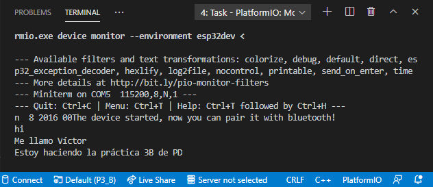
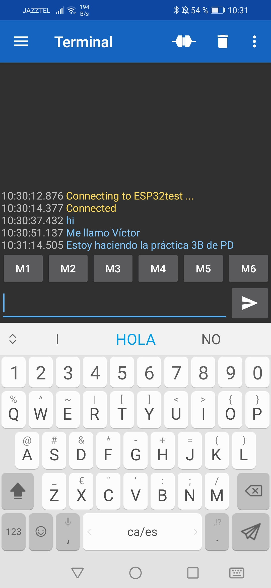

# PRÁCTICA 3B  :  Comunicación Bluetooth Con El Móvil

## 1.Código

//This example code is in the Public Domain (or CC0 licensed, at your option.)
//By Evandro Copercini - 2018
//
//This example creates a bridge between Serial and Classical Bluetooth (SPP)
//and also demonstrate that SerialBT have the same functionalities of a normal Serial
'#'include "BluetoothSerial.h"
'#'if !defined(CONFIG_BT_ENABLED) || !defined(CONFIG_BLUEDROID_ENABLED)
'#'error Bluetooth is not enabled! Please run `make menuconfig` to and enable it
'#'endif

BluetoothSerial SerialBT;

void setup() {

  Serial.begin(115200);
  SerialBT.begin("ESP32test"); //Bluetooth device name
  Serial.println("The device started, now you can pair it with bluetooth!");

}
void loop() {

  if (Serial.available()) {

    SerialBT.write(Serial.read());
  
  }
  if (SerialBT.available()) {

    Serial.write(SerialBT.read());

  }

  delay(20);

}

## 2.Funcionamiento

Ante todo, definimos la libreria "BluetoothSerial.h". Entonces, definimos el objeto SerialBT de tipo "BluetoothSerial" que nos permitirá establecer la conexión bluetooth con nuestro móvil a través de la app "Serial Bluetooth Terminal".

Así pues, inicializamos, dentro del void setup, el dispositivo bluetooth de nuestra placa como "ESP32test" y sacamos por el terminal del Visual Studio Code la línea "The device started, now you can pair it with bluetooth!" para informar al usuario que la placa está lista para establecer la conexión bluetooth.

Posteriormente, vamos a la aplicación del móvil y le damos a establecer conexión con el dispositivo "ESP32test". Una vez hecho todo ésto, gracias a las instrucciones del void loop(), todo lo que escribamos aparecerá en ambos terminales, tal i como se puede apreciar en el siguiente apartado.

## 3.Salida Del Terminal

